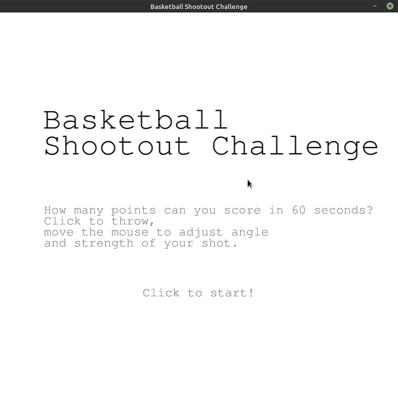

# Basketball Shootout Challenge
This is a simple basketball game in which you use your mouse to score as many points as possible in 60 seconds.

## Gameplay



## Installation (only tested on linux)
```bash
cd <new bball directory>
git clone https://github.com/matsmaiwald/arcade_games.git
python3 -m venv bball_env
source bbval_venv/bin/activate
python3 bball.py
```

